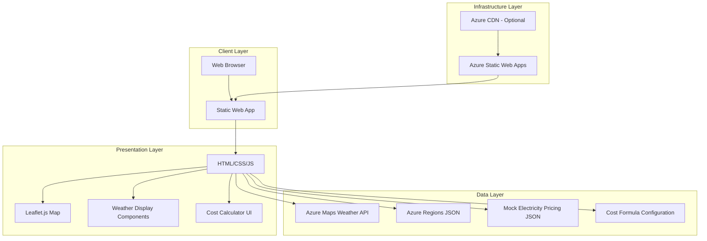
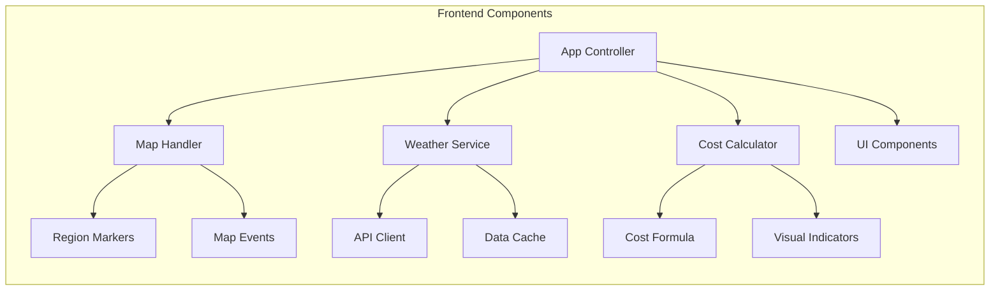
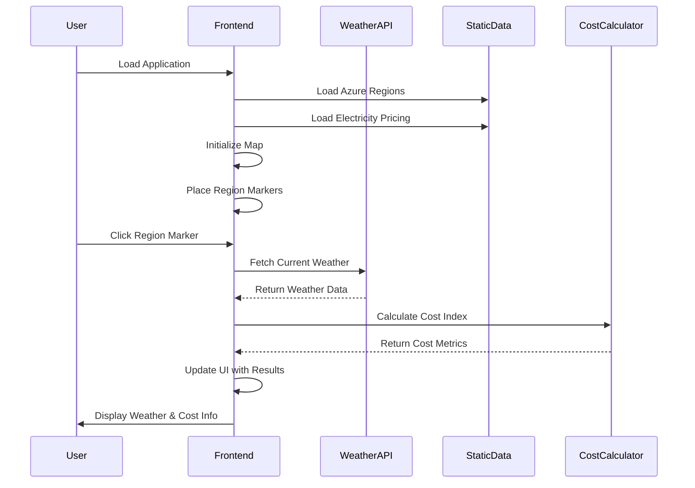
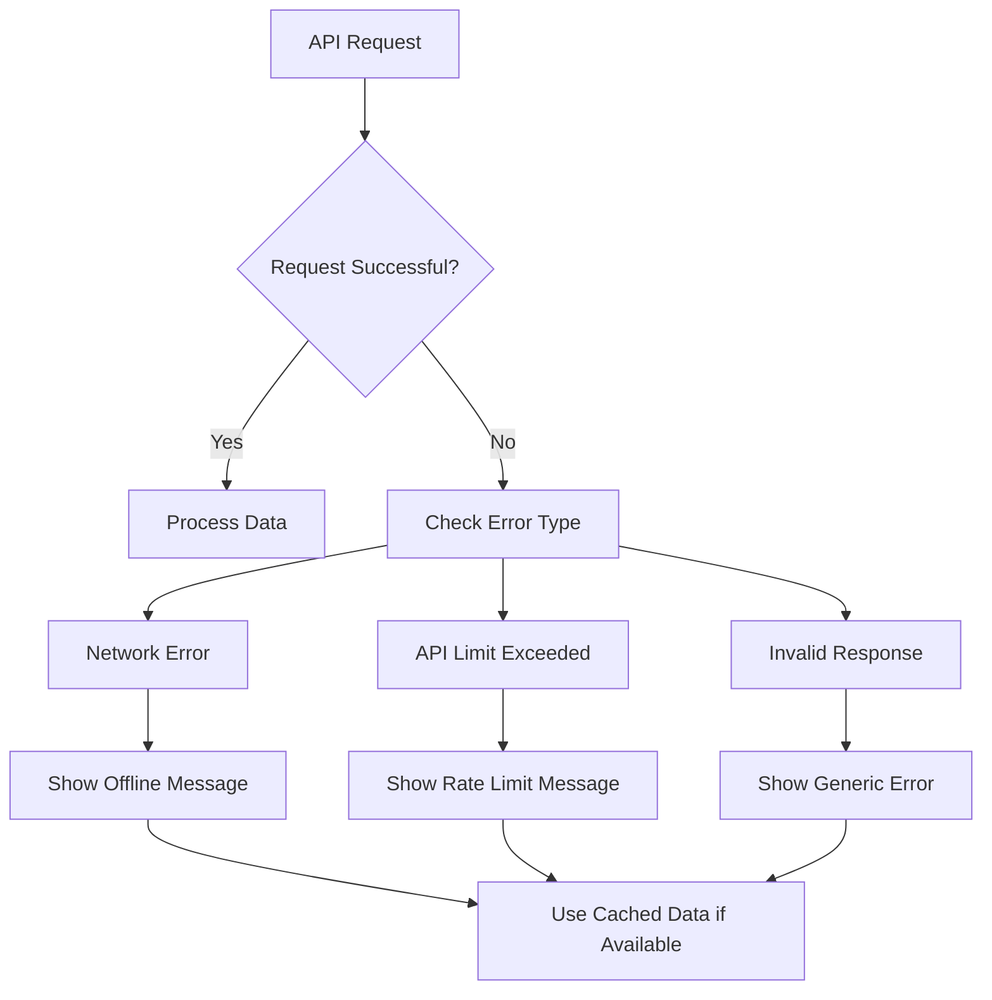

# 🏗️ Architecture Documentation
## Cloudy with a Chance of Cost Overruns

### 📋 Project Overview

**Cloudy with a Chance of Cost Overruns** is a static web application that visualizes real-time weather conditions across Azure regions and provides playful estimates of how weather conditions might influence cloud server operating costs. The app combines educational cloud computing concepts with interactive data visualization.

### 🎯 Core Objectives

- Display real-time weather data for major Azure regions
- Calculate and visualize weather-based cost estimates for data center operations
- Provide an interactive, educational experience about cloud infrastructure considerations
- Maintain simplicity while delivering engaging content

---

## 🏛️ System Architecture

### High-Level Architecture



### Component Architecture



---

## 🧱 Technical Stack

### Frontend Technologies
- **HTML5**: Semantic structure and accessibility
- **CSS3**: Styling with Grid/Flexbox for responsive design
- **JavaScript (ES6+)**: Application logic and API interactions
- **Leaflet.js**: Interactive map visualization
- **Chart.js**: Optional data visualization for trends

### External Services
- **Azure Maps Weather API**: Real-time weather data
- **Azure Static Web Apps**: Hosting and deployment

### Data Sources
- **Static JSON files**: Azure region metadata and pricing data
- **Environment variables**: API keys and configuration

---

## 📊 Data Architecture

### Azure Regions Data Structure
```json
{
  "regions": [
    {
      "id": "eastus",
      "name": "East US",
      "displayName": "East US (Virginia)",
      "coordinates": {
        "latitude": 37.3719,
        "longitude": -78.8964
      },
      "timezone": "America/New_York",
      "electricityPrice": 0.12,
      "currency": "USD"
    }
  ]
}
```

### Weather Data Structure
```json
{
  "temperature": 22.5,
  "humidity": 65,
  "condition": "partly-cloudy",
  "windSpeed": 5.2,
  "visibility": 10,
  "timestamp": "2025-01-01T12:00:00Z"
}
```

### Cost Calculation Model
```javascript
costIndex = (1 + (|temperature - 20°C| * 0.05)) 
          × (humidity > 60% ? 1.2 : 1.0) 
          × (electricityPrice / 0.10)

cloudHealthScore = {
  excellent: costIndex < 1.2,
  good: costIndex < 1.5,
  fair: costIndex < 1.8,
  poor: costIndex >= 1.8
}
```

---

## 🔄 Application Flow

### User Interaction Flow



### Error Handling Flow



---

## 🏗️ File Structure

```
cloudy-cost-overruns/
├── index.html                 # Main application entry point
├── css/
│   ├── main.css              # Global styles and layout
│   ├── map.css               # Map-specific styling
│   └── components.css        # UI component styles
├── js/
│   ├── app.js                # Main application controller
│   ├── weather-service.js    # Weather API integration
│   ├── cost-calculator.js    # Cost calculation logic
│   ├── map-handler.js        # Map initialization and events
│   └── ui-components.js      # Reusable UI components
├── data/
│   ├── azure-regions.json    # Azure region metadata
│   ├── electricity-pricing.json # Mock electricity pricing data
│   └── cost-formulas.json    # Cost calculation parameters
├── assets/
│   ├── icons/                # Weather and cost indicator icons
│   ├── images/               # Logo, backgrounds, etc.
│   └── favicon.ico           # Site favicon
├── docs/
│   ├── architecture.md       # This document
│   ├── api-specs.md          # API specifications
│   └── deployment-guide.md   # Deployment instructions
├── README.md                 # Project overview and setup
└── staticwebapp.config.json  # Azure Static Web Apps configuration
```

---

## 🔐 Security Considerations

### API Key Management
- Weather API keys stored in Azure Static Web Apps environment variables
- No sensitive data exposed in client-side code
- Rate limiting awareness to prevent API quota exhaustion

### Data Validation
- Input sanitization for user interactions
- API response validation before processing
- Error boundaries to prevent application crashes

### CORS Configuration
- Proper CORS headers for external API calls
- Restricted domain access in production environment

---

## ⚡ Performance Optimization

### Frontend Performance
- **Lazy Loading**: Weather data fetched on-demand per region
- **Caching Strategy**: Browser localStorage for static region data
- **Debounced Requests**: Prevent excessive API calls during user interactions
- **Minified Assets**: Compressed CSS/JS for faster loading

### API Optimization
- **Request Batching**: Group nearby regions when possible
- **Response Caching**: Cache weather data for 10-15 minutes
- **Fallback Data**: Graceful degradation with cached or mock data

---

## 📱 Responsive Design Strategy

### Breakpoints
- **Mobile**: < 768px - Stacked layout, simplified map
- **Tablet**: 768px - 1024px - Side-by-side panels
- **Desktop**: > 1024px - Full map with overlay panels

### Mobile Considerations
- Touch-friendly map interactions
- Simplified cost display for small screens
- Optimized loading for slower connections

---

## 🧪 Testing Strategy

### Unit Testing
- Cost calculation logic validation
- Weather data transformation functions
- UI component behavior

### Integration Testing
- Weather API integration scenarios
- Map interaction workflows
- Error handling pathways

### Manual Testing
- Cross-browser compatibility
- Mobile device testing
- Accessibility compliance

---

## 🚀 Deployment Architecture

### Azure Static Web Apps Configuration
```json
{
  "routes": [
    {
      "route": "/api/*",
      "allowedRoles": ["anonymous"]
    }
  ],
  "navigationFallback": {
    "rewrite": "/index.html"
  },
  "mimeTypes": {
    ".json": "application/json"
  }
}
```

### Environment Variables
- `AZURE_MAPS_SUBSCRIPTION_KEY`: Azure Maps subscription key
- `AZURE_MAPS_WEATHER_URL`: Base URL for Azure Maps weather service
- `APP_ENVIRONMENT`: Development/Production flag

---

## 🔮 Future Enhancements

### Phase 2 Features
- Historical weather trend analysis
- Carbon footprint calculations
- User preferences and region favoriting
- Cost alerts and notifications

### Phase 3 Features
- Real electricity pricing integration
- Predictive cost modeling
- Integration with Azure pricing APIs
- Advanced data center efficiency metrics

### Technical Improvements
- Progressive Web App (PWA) capabilities
- Service worker for offline functionality
- Advanced caching strategies
- Performance monitoring integration

---

## 📚 References

- [Azure Static Web Apps Documentation](https://docs.microsoft.com/en-us/azure/static-web-apps/)
- [Azure Maps Weather API Documentation](https://docs.microsoft.com/en-us/rest/api/maps/weather)
- [Leaflet.js Documentation](https://leafletjs.com/reference.html)
- [Azure Regions and Availability Zones](https://azure.microsoft.com/en-us/explore/global-infrastructure/geographies/)